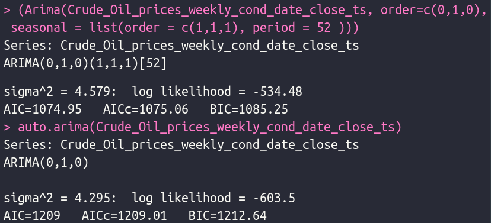
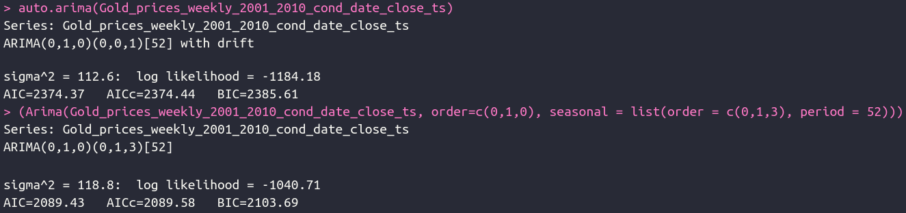

# Arima models, forecasts, and graphs
#### Stefan Skinner
#### 08/Nov/2022
###### [Data from Yahoo Finance](/https://finance.yahoo.com/)
***

#### The non-auto Arima models in this markdown file were arrived at, in part, 
#### by utilizing the following functions:
    01)  isSeasonal(full_ts, test = "fried")

    02)  adf.test(full_ts, alternative = c("stationary")) 

    03)  plot(decompose(full_ts))

    04)  ndiffs(full_ts)

    05)  diff(full_ts, lag = *)

    06)  adf.test(dif_ts)

    07)  urdfTest(dif_ts)

    08)  acf(dif_ts) #for zoomed view

    09)  pacf(dif_ts) #for zoomed view

    10)  plot(decompose(dif_ts))

    11   plot(df_ts, main = "", xlab = "", ylab = "")
   
    12)  lines(fitted(df_forecast), col="")

    13   checkresiduals(df_forecast)

***

#### Crude Oil
#### The auto arima summary in the image below is very basic; the next one below will be more modified i.e. contain "approximation" and "stepwise" equal false, will get only marginally better results, and will take much more time to process than the basic quick style shown initially.

***

###### Crude Oil - Fitted Models
###### not auto

###### auto.arima

###### auto.arima

***

##### Crude Oil - Forecasts
###### not auto

###### auto.arima

###### auto.arima

#### While the first model doesn't fit the data as well as the two that follow it (i.e. it is not overfitted), it still produces the best scores and the best looking graph out of the three.

***

##### Crude Oil - actual '01-'10

***

#### Gold
##### Gold - Model Summaries

***

##### Gold - Fitted Models
###### auto.arima

###### not auto

***

##### Gold - Forecasts
###### auto.arima

###### not auto

***

##### Gold - actual '01-'10

***

#### Silver
##### Silver - Model Summaries

#### Very close!

***

##### Silver - Fitted Models
###### not auto

###### auto.arima

***

##### Silver - Forecasts
###### not auto

###### auto.arima

***

##### Silver - actual '01-'10

***

### E-Mini
##### E-Mini - Model Summaries

***

##### E-Mini - Fitted Models
###### auto.arima

######  not auto

##### The addition of the seasonal component makes the fit look terrible (i.e. it is not overfitted to the data); never-the-less, it still produces the best scores and it adds an aesthetically satisfying wave to the graph. 

***

##### E-Mini - Forecasts
###### auto.arima

######  not auto

***

